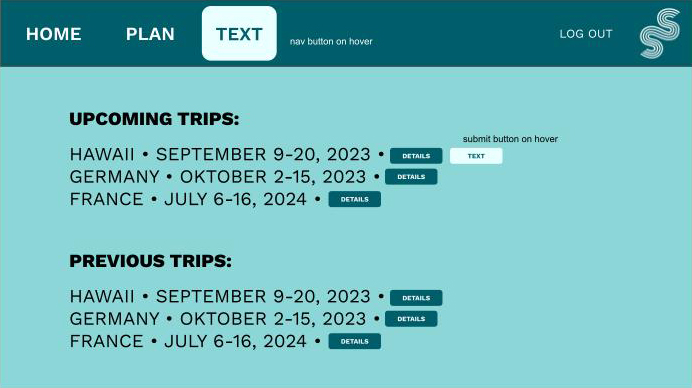
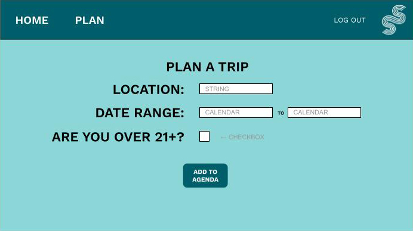
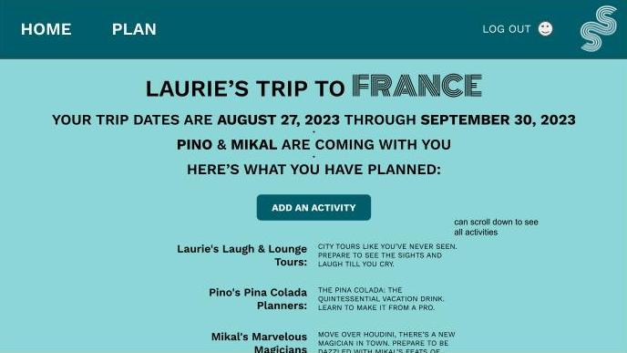
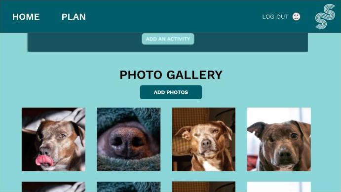

# Scenic Shenanigans Squad

## Let the shenanigans roll!

### Plan and view your adventures on the Scenic Shenanigans website
Keep track of upcoming and previous vacations and let our site be your digital journal. Add dates, locations, activities and photos to all vacations, past and present. Travel buddies can be added if they've created an account on our website!

## Select wireframes
**Homepage** 
 

_________________

**Vacation Index** 
 

_________________

**Create a new trip** 
 

_________________

**Show details of a specific trip** 
  

_________________

**Gallery of user-uploaded images** 
  

## Technology Used
- HTML
- CSS
- JavaScript
- Node.JS
- MongoDB
- Mongoose
- Express
- Google OAuth
- Bootstrap
- ChatGPT's API

## Getting Started
[Visit the Site!](https://scenic-shenanigans-edd3a3d09050.herokuapp.com/)  
[Scenic Shenanigans Planning Doc](https://docs.google.com/spreadsheets/d/1jKdOorlJZ4x6ejF2cYETL-E8nCiXyT8uhOldVsT1uHQ/edit?usp=sharing)

Click "Log In to Enter" and you'll be directed to log in with your Google account. Once logged in, you'll be able to add trips and view your trips. The "Home" button takes you the the index of all your trips, past and future, and "Plan" will take you to a page where you can create a new trip. Clicking "Log Out" will, of course, log you out. You will be returned to the welcome page with the login button.

## Next Steps
Fun future additions to think about:
- error duck quacks whenever you click him
